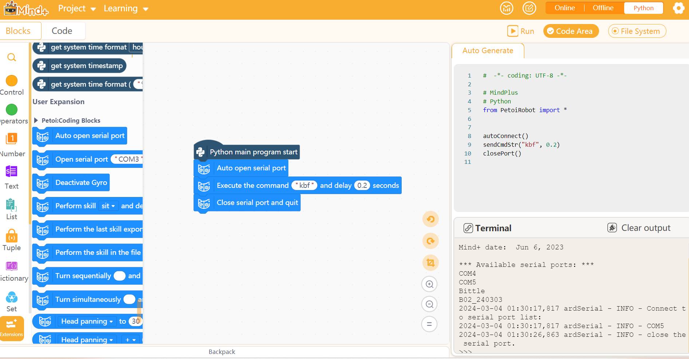
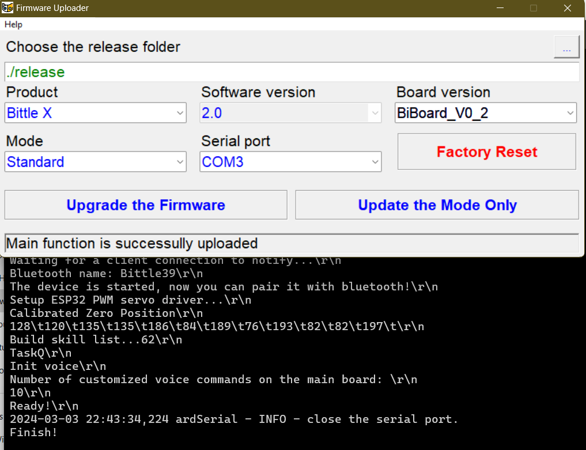
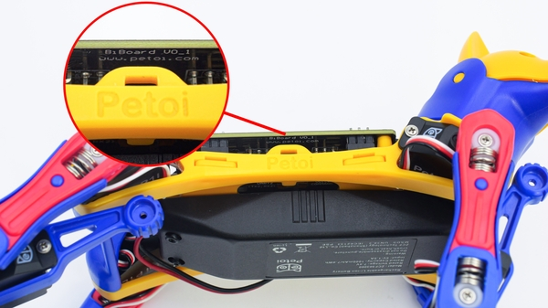
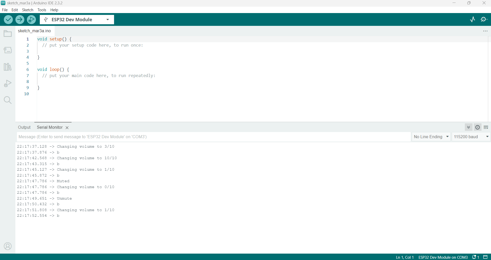

# General Info: Petoi Bittle

Here's everything you need to do to be able to code the Petoi "Bittle X" robot dog.

## Random Notes

* BiBoard (connects to the Rx and Tx pins)
* The serial command `kbf` should be backflip and `kff` frontflip based on [Serial Protocol](https://docs.petoi.com/apis/serial-protocol). When using Mind+, the backflip and frontflip skills do not show up in the "perform skill" drop-down list. I was able to get a backflip and frontflip to occur using the command below. You can straight access serial commands using this for workshops where the students are doing block-based programming.
    

## Setting Up The Devices

To setup the Petoi Bittle make sure you can connect to and upload/update firmware on the Petoi Bittle. Follow the instructions below.

* [Petoi Bittle X User Manual](https://bittle-x.petoi.com/)
* [Getting Started with Petoi Bittle](https://docs.petoi.com/getting-started-guide)
* [Petoi Coding Blocks](https://docs.petoi.com/block-based-programming/petoi-coding-blocks) - This is a good starting place for getting up and going with just what you need to control it with code from Mind+.

## Frequently Asked Questions

Read through the [Frequently Asked Questions](https://docs.petoi.com/technical-support/faq-frequently-asked-questions) page for a lot of answers.

## Firmware Updates and Configuration

Use the resources below for advanced actions such as configuring the Bittle X and updating the firmware. When you update the firemware you well get prompts. Always refer to [this guide](https://docs.petoi.com/desktop-app/firmware-uploader#biboard-for-bittle-x) to know what to choose.

Select no to "reset join offsets" and no to "Calibirate IMU" if you're not sure.

* [Installing the Petoi Desktop App](https://docs.petoi.com/desktop-app/introduction)
* [Uploading/Updating Firmware](https://docs.petoi.com/desktop-app/firmware-uploader)
* [Setup BiBoard Configuration Development Environment](https://docs.petoi.com/biboard/biboard-v0#id-3.2.1-set-up-esp32-development-environment)
* [Upload Sketch for BiBoard](https://docs.petoi.com/arduino-ide/upload-sketch-for-biboard)

The Bittle X uses `BiBoard_V0_1` or `BiBoard_V0_2` as the board version and the `ESP32` as the [development module](https://github.com/PetoiCamp/OpenCatEsp32). Here are the firmware options I've used before that worked for upgrading the firmware on a brand new Bittle X (March 2024). I used `BiBoard_V0_2`, which from the code in the [OpenCatEsp32](https://github.com/PetoiCamp/OpenCatEsp32) repo seems to be their preferred default.

You can find out what version of the board your Bittle has by looking in this area.

Things to do when setting up a Bittle X.

1. Change the volume to be way lower. Serial command `b[0-20]`.
2. Change the voice command type to English. It's not by default. That is changed in `OpenCatEsp32.ino` when configuring the board in Arduino. It's a definition in that file. After changing it, you upload to the board.
3. Deactivate the Gyroscope function. This is what causes the dog to freak out when you pick it up as it's trying to self-balance. To do this, you need to upload the latest sketch from [OpenCatEsp32](https://github.com/PetoiCamp/OpenCatEsp32). When doing so, comment out the line `#define GYRO_PIN` in `OpenCat.h`. This should cause areas where `#ifdef GYRO_PIN` is being used in the code to be skipped.
4. You can disable/enable the voice module by sending serial commands. The command `XAd` disables the voice module. `XAc` enables the voice module. Information is from this [page](https://docs.petoi.com/extensible-modules/voice-command-module).
5. Rename the Bluetooth module to something that makes sense. Sending the serial command `nBluetoothNameHere` will do this. So `nBittle1` would rename the Bluetooth for that robot dog to `Bittle1` plus whatever built in suffixes the software has by default.

Shorter version of that information about what to do with a new Bittle from the serial monitor in Arduino.

1. Set volume to 1 `b1`
2. Rename Bluetooth using `nBluetoothName`
3. Deactivate Gyro using `G`. This is a boolean. If you send it again, you turn it back on. Sending this prevents the dog from freaking out when picked up.
4. Deactivate voice using `XAd`

## Serial Monitor Configuration

[Serial Protocol](https://docs.petoi.com/apis/serial-protocol)

Note: If you're playing around in Arduino, open the file `OpenCatEsp32.ino` in Arudunio from the [OpenCatEsp32](https://github.com/PetoiCamp/OpenCatEsp32) repo as your starting spot.

The `OpenCat.h` file in the repo [OpenCatEsp32](https://github.com/PetoiCamp/OpenCatEsp32) tells you what the serial commands are for configuring the board. Follow the instructions at [Upload Sketch](https://docs.petoi.com/arduino-ide/upload-sketch-for-biboard) for how to get set up in Arduino for sending commands and configuring the board. Then check the `OpenCat.h` file for the latest commands. You can feed the contents of the file to ChatGPT to get back a list of current serial commands if you don't want to read through the whole thing. Here's me using the `b[0-10]` command to change the volume.

## Voice Commands

[List of Commands](https://docs.google.com/spreadsheets/d/1Lr6Cd1T-H9sSdUi_bI-OeMClkVOKjTQM/edit#gid=657477338)

Follow the [Voice Command Guide](https://docs.petoi.com/extensible-modules/voice-command-module). A preconfigured Bittle X can do a lot by voice. For programming workshops with students though, the dog always listening and randomly doing things can be annoying. Here are the instructions for controlling voice input (on/off). Each Bittle X box also comes with a printed list of voice commands for reference.

1. Speak "Bing-Bing" to switch the Bittle X to English mode (note, you do have to say this in a Chinese accent, or it won't pick up on it) or "Di-Di" to switch to Chinese (Mandarin).
2. Speak "Play sound" to turn on the audio response or "Be quiet" to turn off the audio response.

## Coding Controls

To see all the options, visit [Play With Bittle X](https://bittle-x.petoi.com/5-play-with-bittle-x).

Block-based code uses the software `Mind+`. The extension repo is at [Petoi_MindPlusLib](https://github.com/PetoiCamp/Petoi_MindPlusLib). It's worth reading through the `README.md` file there. Basic instructions follow.

1. Go to [Mind Plus Petoi Coding Blocks Instructions](https://docs.petoi.com/block-based-programming/petoi-coding-blocks) and follow the instructions. You don't need to do any configuration with the firmware.
   1. If you're coding the Robot Dog, the Bittle X already has all that supported already. Just download the application and get the Petoi Coding Blocks module imported.
   2. If you're coding the Tello Talent drone, you need to make sure the module for that is imported into Mind+. Follow the instructions here to do that. [Mind Plus Setup For Tello Talent](https://mindplus.dfrobot.com/RMTT)
2. Once the module is imported, connect the Bittle X or Tello Talent. The Bittle connects over Bluetooth, the Tello Talent connects via WiFi.

## Workshop Ideas

Use the resources below to get ideas on using the Petoi Bittle and Tello Talent for workshops.

* [Premade Mind+ Presentations](https://drive.google.com/drive/folders/15SPPlv3NZT9py-m5t_u-f8bbWsAl8HT4)
* [Premade Mind+ Projects](https://drive.google.com/drive/folders/1keMcLnPm1J1E0igdBSIJomEM20GjZBT9)
* [Petoi Curriculum](https://www.petoi.com/pages/free-quadruped-robotics-curriculum-scratch-coding)
* [Petoi Bittle Community](https://www.petoi.com/pages/petoi-open-source-extensions-user-demos-and-hacks)
* [Iowa State Bittle Course](https://www.cyio.iastate.edu/robotics/)

## Troubleshooting

### Petoi Bittle Not Responding To Commands

* Completely remove the device from the Bluetooth on the PC and re-add it. Close the Mind+ application and re-run it.
* Alternatively, close all COM/Bluetooth ports on the PC. You can clear them using terminal commands, then re-connect the Bittle.
* Close the Mind+ application, unload the extension, reload it, and re-open the application, all those things have at times gotten the dog back to working.

### Misc Issues

* Sometimes the close serial port and quit command doesn't stop the Python program. If that happens, you can still work through it, you'll just have to manually hit stop when the code has finished executing. 

### Bluetooth Connection Asking for Pin

* If you're being asked to confirm a pin, or enter a pin, first read [this article](https://docs.petoi.com/communication-modules/dual-mode-bluetooth) to make sure your issue isn't solvable with the guide.
* If you're still having issues, note that each Petoi Bittle has two bluetooth signatures it sends off. For example, `BittleA0` and `BittleA0_SSP` coming from the same dog. I was once connecting to the `_SSP` one and was able to get past the pin confirmation prompt by connecting to the `BittleA0` one and it worked with Mind+. So alternate between the Bluetooth options if stuck. The SSP stands for Serial Port Profile, which I learned by reading through the code at [OpenCat.h](https://github.com/PetoiCamp/OpenCatEsp32/blob/main/src/OpenCat.h).
  