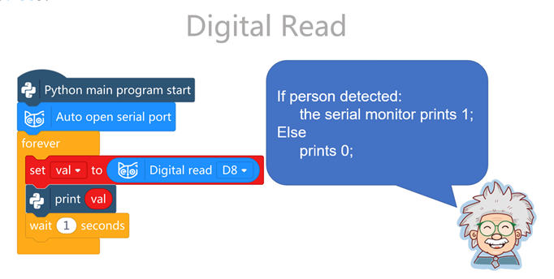

# User Story: Robot Guard Dog

## Description

Using the Passive Infrared (PIR) Motion Sensor, write a Python program that turns the robot dog into a guard. Whenever someone passes by its general vicinity, the robot dog should take certain defensive and alerting actions.

## Implementation Details

The following actions should be taken when someone passes within activation distance of the PIR Motion Sensor.

1. The robot dog should begin in a seated position.
2. The robot dog should trot forward for 5 cycles (loops).
3. The robot dog should perform 3 cycles (loops) of boxing.
4. The robot dog’s LED light should light up.
5. An alarm sound should be played by the robot dog for 30 seconds.
6. The robot dog should turn 180 degrees and trot in the opposite direction 5 cycles (loop iterations) and return to a sitting position.

To get started, try writing this code using the Mind+ block-based editor and copying the auto-generated Python code that displays to the right. This code will teach you how to read values from the PIR Motion Sensor.

Now that you have the sensor’s return value, what can you do with it? What can Bittle do?

After implementing the requirements, feel free to add additional functionalities to your program that emulate guard dog behavior.

## Acceptance Criteria

### 1. Initial Seated Position

- **GIVEN:** The robot dog is in guard mode with the PIR Motion Sensor active.
- **WHEN:** The program starts.
- **THEN:** The robot dog should begin in a seated position.

### 2. Detect Motion and Trot Forward

- **GIVEN:** The robot dog is in guard mode with the PIR Motion Sensor active.
- **WHEN:** Someone passes within the activation distance of the PIR Motion Sensor.
- **THEN:** The robot dog should trot forward for 5 cycles (loop iterations).

### 3. Perform Boxing

- **GIVEN:** The robot dog has trotted forward for 5 cycles.
- **WHEN:** The trotting action is complete.
- **THEN:** The robot dog should perform 3 cycles (loop iterations) of the boxing action.

### 4. LED Light Activation

- **GIVEN:** The robot dog has detected motion with the PIR Motion Sensor.
- **WHEN:** The sensor is activated.
- **THEN:** The robot dog’s LED light should light up immediately.

### 5. Play Alarm Sound

- **GIVEN:** The robot dog has detected motion with the PIR Motion Sensor.
- **WHEN:** The sensor is activated.
- **THEN:** The robot dog should play an alarm sound for 30 seconds.

### 6. Return to Initial Position

- **GIVEN:** The robot dog has completed the boxing action.
- **WHEN:** The boxing action is complete.
- **THEN:** The robot dog should turn 180 degrees and trot in the opposite direction for 5 cycles (loop iterations) and return to a seated position.
