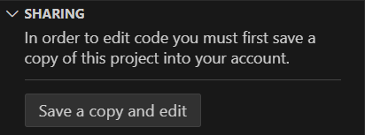

# How To Train Your AI: Demystifying ChatGPT With Machine Learning, Neural Networks, and Deep Learning Basics

How To Train Your AI Demystifying ChatGPT With Machine Learning, Neural Networks, and Deep Learning Basics

Random Notes below that need to be incorporated into the overall document. The goal of this document is to have the full workshop, what needs to be taught, and then two activites. one that happens via a PowerPoint where you try to train a neural network live with the class, chalelnging them to see how hard it is, and then one that involves using Visual Studio Code for Educaiton in some way where students visit the website and there's a project that relates to what's being taught here where they're writing code to solve some problem, to figure something out ,and it's giving them output. Ideally, their code would take them through some sort of coding exercise where when they solve hte problem or adjust the code they see how an AI system gets trained like neural neoworkis/ machine learning/ deep learning but in a very simple way that gets them the overall concetp. If there's a way to do this using the Open AI API or Hugging Face that doesn't get so complicated that studnets in high school with limited techincal backgronud would not be confused that'd be good.

---

Fill In The Blank
Let's play a quick game of fill in the blank:

to be or not to _____
Why did you immediately think of the word be to fill in that blank, instead of the word banana or fish? Because you've seen the phrase many times and your brain has learned the most likely next word is be.

Let's do another one:

rock and ____
Did you think of the word roll? Why? Because that's the word you see most often following the words rock and.

How about this one:

I am very _____
This is less clear - the next word depends on the context.

I just ran a marathon. I am very _____
Perhaps now you would say tired. Or happy, or proud.

The above, This is an activity. To explain this kind of machine learning, you do this very thing on the slides. Show some phrases, maybe choose more relatable phrases to the students, and you have them guess the next word, and give this very explanation.

---

Maybe after doing the activity with human langauge you do an actiivty trying to train on some made up foreigh language that you create .Some sort of gibberish langauge. Maybe that's what the coding activity is. You train a large langauge model, or a small language model, in an exteremly limited fashion, to be able to produce output in some sort of gibberish lanaguage. Or you start with a very small model and a goal, for it to be able to understand something or produce text in some specific way, and the code students have to write get it to that point.

---

When you're explaining ChatGPT and how it works mention Markove chain. Distil it down so that students understand it. You don't need to dwell too much there, but you should be mentioning all the fancy complicated topics they need ot learn to undrestand things so they can look it up later if they want and make it simple for them. Defintio nbelow.

In probability theory and statistics, a Markov chain or Markov process is a stochastic process describing a sequence of possible events in which the probability of each event depends only on the state attained in the previous event. From https://en.wikipedia.org/wiki/Markov_chain

---

Drive home the concept of AI training itself on text by looking at how frequently words appear after one another. It's given a piece of text, asked to uesss what word comes next, then compares it's guess to the right answer, the word that actually came next in the real text. it does this not just for one word but for phrases, for pieces of text, every possible permutaiton you can think of, building freuqency tables, doing this over many diverses types of text ,doing it insanely fast because of parallelization provided by GPUs and massive compute that really only big tech companies have .The result is it's able to produce text that seems like wow, did a real live thing write this? Nope, it's probability, math, frequency, with no real understanding or sentience, but it sure does seem real, and that my friend is why we call it artifical intelligence. Be sure that htis explanation is correct though. Double check this concept for accuracy.

--- 

Could hte coding actiivty be a sort of makeshift small scale Markov machine that helps studnets train text and then see how it goes from nonsenical to making sense and includes some sort of output of the frequency table so that they realize this thing is not alive it's really just measuring probabilties? There's a website, http://www.almeopedia.com/markov3test.html, that allows you to do this. It's described as 

  Mark's Markov3 Machine
This is a Javascript program which allow you to generate Markov texts from some of my corpora.
The program uses three-word sequences. So, given two words X Y, it will choose a word Z that has followed them, favoring those that most often occurred.

See the main page for what these are and how you can modify it to make and use your own corpus. The C code for it is at https://www.zompist.com/markov3.c but I would want to use python for my VS Code for Education worshop. My version doesn't need to be that ocmplicated, I really just need students to be able to see "How to Train Your AI" and then essentially they end up creating a ChatGPT like system from what was just nothing when they showed up. The workshop can kind of hand hold htem through the answers.

---

Important note taken from https://www.parand.com/a-non-technical-explanation-of-chatgpt.html?__readwiseLocation=

Aside: You might run into the term "stochastic" as you look into language models - this just means randomly determined. For example, you might hear people argue whether these systems are Stochastic Parrots, implying the systems are simply parroting back the original text that they saw, with some randomness thrown in.

---

You must transition the above information related to machine learning using Markov's method to how that doesn't scale in all cases and plug in Deep Leanring. By the time the powerpoint part of the presentation is over Machine Learning, Neural Networks, Deep Learning, and how it all relates to ChatGPT should be covered, in that order, including calling out the different types of learning and they difffer. The goal through it all is to keep it simple, basic, but accurate. Oversimplified, but not inaccurate or misleading.

---

It's going ot be key to acknowledge that not all types of training are image based where there's the binary "is it a cat or not". Make sure hte workshop clearlycalls out that's not how ChatGPT text based stuff works and transtions to that. In fact, it may be benefecial to cover only how text based stuff wroks and not get into the image training stuff at all. I almost feel as if if you can explain how text based large language models work and get your group to understand it, then if they're interested in how images work, that can be a follow up, maybe  ashort slide at the end, or a different workshop. Jamming it all into one is going to get convoluted. However, if there's a smooth way to integrate it, then go for it. Maybe do the activity with the cat/image recongition, have them try and write a desription, explain what kind of learning that is, itnroduce all the big buzz words and define them, the nask "so do you think that's how ChatGPT works when it's text based? How doe sit know how to produce words that sound human?" and then you transition. You briefily touch on why that doesn't work for text based models, language based models, the nyou transition to the acitivty of freuqnecy tables, then one that ties in the deep leanring aspect ,and yo uend with the coding activit on VS Code for education.

**The workshop is 1 hour in total**. You want to leave about 30 minutes for the coding portion, mayube 25 at the minumum.

---

If you mention markarov and the freuuency table you must also mention that you don't build htat freuqncy table manually. Importantly, you use Deep learning, and you've got to amke it clear what deep learning is and how it relates.

---

Going from trying to make your own prediction table to deep learning ivnovles feeding the computer, the function, the code, a piece of text but withholding information about the last piece. IT tries to guess what the lat word is, compares this to the actual answer, and adjusts its weights. So deep learning works for training models that produce text or models that need ot recognize images or voices or various other things. In this instance of text it's a predict-the-next-word game/task happening over the entire source text (which I think is called corpus? not sure).

---

 You've got to mention fine tuning. After you do all this training, you let humans use it, and they tell you if responses are good or bad, make sense or not, and you use that to impact the model. Now it's getting better and better becaues it's able to get even more feedback beyond predicte the next word or knowing if it' sa cat or not, as to wehter it's output as valuable to it' starget audience of humasn.This is fine tuning. it should come up in the workshop, but in a way that's basica nd easy to understand.

 It is 

 Human-in-the-Loop Training: After initial training, the model is refined based on human feedback to improve conversational and helpful responses.

 You've got to mention that after all this fancy computer science stuff it still can suck prett ybad without human feedback, which is also why sometimtes it doesn't answer your qestions well, doesn't understand what you're saying, halluciantes. It's not what you think it is. It does not understand anything you'er saying at all. it's math and probabilties so wel ltrained and finely tuned on real human producitons, our real books and text and images, that it seems like it can think like us, artifically intelligent.

## Workshop Overview

* **Duration:** ~1 hour (approx. 30 min presentation, interactive activity, & discussion, 30 min coding activity)

* **Required Materials:** Pen, paper, and laptops with Internet access, preferably 1 per 4-5 students.

* **Audience:** Students ranging from high school to college, with skill levels spanning from little to no technical background to those with significant experience.

* **Goal:** By the end of this workshop, students should have a fundamental understanding of what AI and ChatGPT are doing under the hood, how Machine Learning (ML), Neural Networks (NNs), and Deep Learning (DL) fit together, and experience a hands-on coding activity to reinforce these concepts in a simplified form.

## Introduction: What Is Artificial Intelligence?

Modern Artificial Intelligence (AI), including **Generative AI** like ChatGPT, might seem magical, but it's really about patterns, math, and practice—lots and lots of practice. It's not the sentient, futuristic robots of Hollywood (*iRobot*, *Avengers: Age of Ultron*, *Terminator*, *WALL-E*, etc.).

AI doesn't "understand" things the way humans do. When shown an image or given a prompt, it doesn't truly know what it's looking at or what you're asking. Instead, AI functions as an advanced computer system that analyzes data to detect patterns, makes educated guesses, verifies them against known outcomes, and improves over time through feedback. Eventually, through a process of trial and error, it gets so good at predicting and generating outputs that it seems intelligent.

**Key Concept:** At its core, AI is about training computers to learn from data. This is achieved through a process called Machine Learning, which can be thought of as a highly sophisticated, scaled-up version of guess-and-check. The AI (a complex computer program) makes a guess, compares it to the correct answer provided by humans—whether it's identifying an image of a cat or predicting the next word in a sentence—and adjusts itself based on the result. By repeating this millions or billions of times with real, human-created data, the AI refines its guesses until it produces results that seem like true understanding but are actually just well-tuned patterns.

## The Foundations of AI: Machine Learning, Neural Networks, and Deep Learning

To understand how AI systems like ChatGPT work, it's essential to grasp three interconnected concepts: **Machine Learning**, **Neural Networks**, and **Deep Learning**. These terms describe the methods and structures that allow AI to learn and make predictions. At its core, that's all AI is doing—taking input, analyzing it, and guessing the output based on mathematical calculations and probabilities (those high school and college calculus and statistics classes really do matter!).

Here's the process broken down: AI simplifies the input it receives—whether it's an image or text—into numbers that computers can understand. For images, this means breaking them down into **RGB values** (the red, green, and blue components that combine to form every pixel of the image). For text, the process is similar but more abstract: the words are converted into numerical representations through techniques like word embeddings, which map words or phrases to arrays of numbers, capturing their meaning and relationships.

By processing these numerical inputs, the AI relies on math and probability to identify patterns and make predictions, continuously refining its approach through training and feedback. This combination of simplification, pattern recognition, and iterative learning is the foundation of how systems like ChatGPT work.

**In Short:**

* **Machine Learning** is the overall field of teaching computers to learn from examples.
* **Neural Networks** are a specific technique within Machine Learning that processes data through layers of neurons.
* **Deep Learning** is a subset of Neural Networks with many layers, allowing AI to learn intricate patterns and make sophisticated predictions.

### Different Types of AI Training

Before diving deeper into Machine Learning, Neural Networks, and Deep Learning, let's explore how AI models are trained. The way an AI learns depends on the type of data it's given and the task it needs to perform. This helps clarify how a system like ChatGPT is trained versus an AI designed to recognize cats in images.

1. **Supervised Learning (Labeled Data):**  
   Imagine you want an AI to recognize cats in images. In supervised learning, humans label data ahead of time—e.g., "this is a cat" or "this is not a cat." The AI looks at these examples, guesses, checks its guess against the label, and improves by adjusting hot it processes similar data in the future. After seeing enough labeled examples, it becomes skilled at identifying cats in new, unlabeled images.

   *Supervised learning works well for tasks like image recognition or spam email detection, where we can easily provide labeled data.*

2. **Self-Supervised Learning (Patterns in Raw Data, No Labels):**  
   ChatGPT and other large language models use **self-supervised learning**, which doesn't rely on human-created labels for every piece of data. Instead, the AI trains itself by learning patterns in massive amounts of raw text.

   Here's how it works for ChatGPT:  
   * The AI sees a sentence like "The cat sat on the ___" and tries to guess the missing word (e.g., "mat").  
   * If the guess is wrong, the system fine-tunes its process to handle similar patterns better next time.
   * By repeating this process billions of times, the model becomes very good at predicting the next word based on context, which allows it to generate coherent sentences, understand grammar, and mimic human-like responses.

   Unlike the cat example, ChatGPT isn't learning fixed answers like "this is a cat." Instead, it's learning how language flows, how words and ideas are related, and how to predict the best continuation for a given prompt.

**Key Concept:** Supervised learning is like giving the AI a multiple-choice quiz with the answers provided for grading. Self-supervised learning, used by ChatGPT, is like giving the AI a fill-in-the-blank test with no explicit answers—just patterns from the text itself. Regardless of the method, the core process remains the same: guess, check, adjust.

### Machine Learning: Teaching Computers to Learn

Machine Learning is the broad field of teaching computers to learn from examples rather than following step-by-step instructions. Instead of explicitly programming a computer to recognize a cat or predict the next word in a sentence, you give it data and let it figure out patterns on its own.

#### How It Works

1. **Input Data:** The computer is given data (e.g., images, text).  
2. **Prediction:** It makes a prediction (e.g., "Is this an image of a cat?", "Is 'roll' the next word in the phrase 'rock and ___'?").  
3. **Feedback:** It checks its prediction against the correct answer provided in the data (e.g., "Yes, this is a cat" or "No, the correct word is 'roll'").  
4. **Adjustment (Weights):** The computer adjusts **weights**, which are numbers that represent how strongly it should consider different features of the input. For example:
   * In an image, certain pixel patterns might become "important" for recognizing a cat.
   * For text, certain word combinations might weigh more heavily in predicting the next word.
5. **Repetition:** This process is repeated millions of times until the model gets highly accurate.

**Key Concept:** The computer doesn't "know" what a cat or a word is—it just analyzes the examples we provide and learns the patterns that humans have created in real-world data. These examples form the foundation for its guesses and improvements.

#### What Are Weights?

Imagine weights as dials that the computer adjusts to make better guesses. These dials control how much attention the system pays to different parts of the input data.

* **Example 1 (Image):** If the computer is learning to recognize a cat, it might initially pay equal attention to all parts of an image. Over time, it adjusts its weights to focus more on patterns like whiskers or triangular ears.
* **Example 2 (Text):** When predicting the next word in "The cat sits on the ___," the model adjusts its weights to give more importance to words like "sits" and "on," which help predict "mat".

Weights are the computer's way of learning which features in the data matter most for the task it's trying to solve. At first, these weights are random. As the model gets feedback, it tweaks the weights to improve.

Adjusting weights is like refining your guesses over time. Imagine if you guessed answers on a multiple-choice test without studying. After seeing which answers were correct, you'd (hopefully) start noticing patterns and improve your guesses on the next test. Weights are how the computer "learns" those patterns and becomes more accurate.

#### Pseudo Code Example

Here's a simplified Python-based pseudo-code to connect the concept of Machine Learning with code. This example uses a basic "guess-and-check" loop for predicting whether an image is a cat.

```python
# Imagine that we have images represented as pixel brightness values (numbers).
# Each number in the "image" list represents how bright a certain part of the image is.
#
# We're simplifying a lot: we say that "average brightness" might tell us something about whether it's a cat.
# Real AI uses far more complex and numerous features, but this helps us see how learning works:
# We guess, compare to reality, and adjust.

training_data = [
    {"image": [0.1, 0.5, 0.7], "label": 1},  # In our data, this image is a cat.
    {"image": [0.3, 0.2, 0.1], "label": 0},  # In our data, this image is not a cat.
]

# Weight: A single number representing how much we rely on brightness.
# Initially, we have no idea how brightness relates to being a cat, so we start with a guess of 0.5.
#
# The weight is crucial because it's the ONLY thing that changes as we learn.
# By adjusting the weight, we change how the brightness (input) influences our guess.
weight = 0.5

# Learning rate: How quickly we adjust our belief about brightness after seeing each example.
# A small learning rate means we make gentle adjustments, so we don't over correct.
learning_rate = 0.1

print("Beginning training...\n")

for data in training_data:
    image = data["image"]
    label = data["label"]
    
    # Step 1: Make a guess based on brightness.
    # We take the average brightness and multiply it by the weight.
    #
    # Why do we multiply by a weight?
    # Think of the weight as a dial we can turn to adjust how strongly brightness influences our guess.
    # By using weight * brightness, every time we change the weight, we change the output of the guess.
    #
    # Without this multiplication step, we'd have no way to adjust the guess in response to mistakes.
    # The input (brightness) itself doesn't change, so the only way to improve is by tuning the weight.
    # Each time we see how wrong we were and tweak the weight, we're effectively turning the dial so the same brightness leads to a closer-to-correct guess next time.

    average_brightness = sum(image) / len(image)
    guess = weight * average_brightness

    print(f"Image Data: {image}")
    print(f"True Label: {label} (1 = Cat, 0 = Not a Cat)")
    print("Current Weight:", weight)
    print(f"Average Brightness: {average_brightness:.3f}")

    # Here is the core idea:
    # We combine brightness (the input) with weight (our adjustable factor).
    # The guess = (input) * (weight).
    # If guess is close to 1, it means with this weight, brightness suggests 'cat'.
    # If guess is close to 0, it suggests 'not cat'.
    print(f"Initial Guess (Weight * Brightness): {guess:.3f}")
    if guess > 0.5:
        print("  - Guess > 0.5, leaning towards 'cat'.")
    else:
        print("  - Guess <= 0.5, leaning towards 'not cat'.")

    # Step 2: Check how wrong we are.
    # error = label - guess
    # If error is positive, we were too low, so we should increase the weight.
    # If error is negative, we were too high, so we should decrease the weight.
    error = label - guess
    print(f"Error (Label - Guess): {error:.3f}")
    print("  - Positive error: we under-guessed 'cat-likeness'. We'll increase weight.")
    print("  - Negative error: we over-guessed 'cat-likeness'. We'll decrease weight.")

    # Step 3: Adjust the weight.
    # This is where learning happens.
    # By changing weight, next time we multiply the brightness by a slightly different number.
    # Over multiple examples, this shifts our guesses closer to correct answers.
    old_weight = weight
    weight += learning_rate * error
    print(f"Updated Weight: {weight:.3f} (Old: {old_weight:.3f} + (Learning Rate: {learning_rate} * Error: {error:.3f}))")
    print("  - Notice: The input (brightness) didn't change, the label didn't change,")
    print("    but the weight did. On the next guess, the same brightness will produce a different guess,")
    print("    hopefully closer to the truth because we adjusted the weight.\n")

    print("---\n")

print("Training complete.\n")
print(f"Final Weight after seeing all examples: {weight:.3f}\n")
print("This final weight is our 'learned' understanding of how brightness relates to being a cat.")
print("By adjusting the weight each time, we used the exact same input data but got closer to the correct answer.")
print("No input was changed, we just tuned the weight to improve future guesses.\n")
```

**Key Concept:** We used "brightness" as a stand-in for any feature the AI might consider. In reality, a model might look at many different features, not just brightness. Over time, by adjusting the weight, the model learns whether brightness is a good clue to determine if something is a cat. This is, of course, a simple example—real Machine Learning uses more complex algorithms and data structures.

### Neural Networks: Mimicking How Brains Work

Neural Networks are a way to teach computers to recognize patterns, inspired by how the human brain works. **Neural Networks are a subgenre of Machine Learning**. They're a specific approach within the larger field. Your brain has tiny units called neurons, each responsible for processing specific details, like detecting colors, edges, or shapes in a picture. Neural Networks mimic this process in computers, but their "neurons" are virtual—small mathematical functions or programs that analyze bits of information to recognize patterns.

These neurons are organized in **layers**, like an assembly line. Each layer has a specific job:

1. The first layer picks out very basic details.
2. The second layer builds on those details to find bigger patterns.
3. The third layer uses those patterns to figure out what the input might be.

By stacking layers, the network can go from seeing small details to recognizing the bigger picture.

#### How It Works

When Neural Networks process data, they pass it through layers, each one doing a little more work than the last. Each layer has a job that builds on the previous one, going from simple details to more complex patterns. This layered approach allows the network to recognize almost anything—from images to text—by breaking the problem into smaller, manageable steps. It's like solving a puzzle: each layer contributes one piece until the big picture emerges.

Let's break it down with **two examples**:

##### Example 1: Image-Based Input

Suppose you're training a Neural Network to recognize pictures of cats:

1. **First Layer (Basic Details):**  
   The first layer of neurons looks at the raw data (the image, which is really just a grid of numbers representing pixel colors).  
   * Example: It might notice lines, edges, or areas with similar colors.

2. **Second Layer (Patterns):**  
   The second layer takes those lines and edges and looks for shapes.  
   * Example: It might spot circles (eyes) or triangles (ears).

3. **Third Layer (Recognition):**  
   The third layer combines those shapes into objects.  
   * Example: It might say, "Two circles and a triangle arranged like this? Probably a cat."

##### Example 2: Text-Based Input

What about recognizing text or generating words, like **ChatGPT**?

1. **First Layer (Basic Word Features):**  
   The first layer takes a sentence as input. Each word is converted into numbers (called vectors) that represent its meaning or context.  
   * Example: The word "cat" might be represented by numbers showing its relationship to words like "pet" or "animal."

2. **Second Layer (Relationships Between Words):**  
   The second layer analyzes how the words are related.  
   * Example: It might see that "cat" and "sits" often appear together.

3. **Third Layer (Understanding Context):**  
   The third layer uses this relationship to understand the overall meaning or predict what comes next.  
   * Example: If the input is "The cat sits on the ___," the network might predict "mat" because it has seen that pattern many times during its training on real text that humans wrote.

**Key Concept:** Each layer passes its output to the next layer. The first layer might pick out very simple patterns, and the next layer builds on that to find more meaningful patterns. Finally, we make a guess at the end. If we're wrong, we adjust the weights throughout the network so we do better next time.

#### Pseudo Code Example

Here's a Python-based pseudo code example showing how a Neural Network processes data through layers. We'll keep this as simple as possible:

* We'll imagine we have a tiny network with just two layers, each with a single neuron.
* Our input will still be a simplified image represented by a few brightness values.
* The first layer's job: turn raw pixel values into a simple pattern clue.
* The second layer's job: use that clue to guess if it's a cat or not.
* Then we'll adjust weights if we're wrong, just like before in the Machine Learning pseudo code example.

```python
# Let's assume you've read the Machine Learning example pseudo code.
# There, we took the input (e.g., brightness), multiplied by a weight, made a guess, and adjusted the weight.

# Now, a Neural Network does the same thing, but in layers:
# 1. The input goes into a first layer of "neurons"
# 2. That layer's output becomes the input to a second layer of neurons
# 3. The final layer makes a guess and we adjust weights in BOTH layers if we're wrong

image_data = [0.1, 0.5, 0.7]  # Example input
label = 1  # Correct answer: this image should be recognized as a cat (1 = cat)

# Two layers of weights:
# Layer 1 converts raw input into a simpler pattern
layer_1_weights = [0.2, 0.3, 0.1]  # One simple neuron

# Layer 2 takes that pattern and decides if it's a cat or not
layer_2_weights = [0.4]  # Another simple neuron

learning_rate = 0.1

def simple_neuron(inputs, weights):
    return sum(input_value * weight for input_value, weight in zip(inputs, weights))

# Step 1: Layer 1 processes the input
layer_1_output = [simple_neuron(image_data, layer_1_weights)]

# Step 2: Layer 2 processes Layer 1's output to produce a final guess
final_guess = simple_neuron(layer_1_output, layer_2_weights)

# Check how far off we are (error)
error = label - final_guess

print("Initial Conditions:")
print("  Image Data:", image_data)
print("  Desired Label (Correct Answer):", label)
print("  Layer 1 Weights:", layer_1_weights)
print("  Layer 2 Weights:", layer_2_weights)
print("\nFrom Input to Output:")
print("  Layer 1 Output (pattern from raw data):", layer_1_output)
print("  Final Guess before adjusting weights:", final_guess)
print("  Error (Label - Guess):", error)

# Adjust weights in Layer 2 based on the error
for i in range(len(layer_2_weights)):
    layer_2_weights[i] += learning_rate * error * layer_1_output[i]

# Adjust weights in Layer 1 based on the error and input
for i in range(len(layer_1_weights)):
    layer_1_weights[i] += learning_rate * error * image_data[i] * layer_2_weights[0]

print("\nAfter Adjustments:")
print("  Updated Layer 1 Weights:", layer_1_weights)
print("  Updated Layer 2 Weights:", layer_2_weights)

print("\nIf we passed the same input again now, our guess would likely be closer to the correct answer.")
print("This is how the network 'learns': by tweaking the weights at each layer so that next time,")
print("the same input leads to a guess closer to the correct label (cat in this case).")

print("\nRemember: This is extremely simplified.")
print("Real neural networks have many neurons per layer, more layers, and more complex calculations.")
print("But the idea remains: multiple layers refine the data step-by-step, and adjusting weights")
print("after seeing the error makes the model smarter over time.")
```

That's it! It's the same guess-check-adjust process as before, but now we have layers:

* Layer 1 transforms the input
* Layer 2 uses Layer 1's output to make a final guess
* If we're wrong, we tweak weights in BOTH layers so the entire network improves next time.

### Deep Learning: Neural Networks, Supercharged

Deep Learning takes the idea of Neural Networks a step further by adding many more layers—making the network "deeper." More layers mean the network can recognize much more complex patterns. It's still the same guess-check-adjust cycle you've seen in Machine Learning and Neural Networks, but on a much larger scale and often using more powerful computers to handle all the extra calculations.

**Key Concept:** Deep Learning enables systems like ChatGPT to understand the context of sentences, recognize objects in complex images, or even generate realistic-sounding text. Each additional layer refines the data a bit more, allowing the model to identify very subtle relationships. It's the backbone of the most advanced AI applications today.

#### How It Works

1. **Many Layers:** Instead of just one or two layers, Deep Learning models might have dozens, hundreds, or even thousands. Each layer focuses on a different aspect, starting from basic patterns and moving toward very complex concepts.

2. **Complex Patterns:** More layers let the model detect extremely intricate patterns. For an image, early layers might find edges and shapes; middle layers might recognize parts of objects (like eyes or ears), and later layers might piece these parts together into entire objects (like a cat sitting on a mat). For text, early layers understand letters or word pieces, middle layers understand word meanings and sentence structure, and later layers grasp entire paragraphs or even the style of writing.

3. **Massive Data and Computation:** Deep Learning usually involves huge amounts of data and often requires specialized hardware (like GPUs) to process everything quickly. This makes sense because with many layers, there are many more weights to adjust and a lot more learning to do.

**In Short:** Deep Learning is just neural networks with lots and lots of layers, allowing the model to learn incredibly detailed and sophisticated patterns.

#### Pseudo Code Example

We've seen how Machine Learning and Neural Networks work in simplified code. For Deep Learning, the idea is exactly the same—guess, check, adjust—but with more layers. Let's show a very high-level, extremely simplified pseudo code example:

```python
# In our Machine Learning example, we had one layer.
# In our Neural Networks example, we had two layers.
# In Deep Learning, we have many layers, each doing the same "multiply inputs by weights and add them up" step.

# Example input (just pretend it's some data, like image pixels or text embeddings)
input_data = [0.1, 0.5, 0.7]

# Instead of 1 or 2 layers, let's say we have multiple layers.
# Each layer has its own set of weights.
# (In reality, you might have dozens or hundreds of layers, each with many neurons, but we'll keep it tiny.)

layer_1_weights = [0.2, 0.3, 0.1]
layer_2_weights = [0.4, 0.6]
layer_3_weights = [0.5, 0.5]
# Imagine more layers if needed, many, many, many more layers…

def simple_neuron(inputs, weights):
    return sum(i * w for i, w in zip(inputs, weights))

# Process the data step-by-step through each layer:
layer_1_output = [simple_neuron(input_data, layer_1_weights)]
layer_2_output = [simple_neuron(layer_1_output, layer_2_weights)]
layer_3_output = [simple_neuron(layer_2_output, layer_3_weights)]
# …and so on, until a final layer gives us a final_guess.

# final_guess is the model's prediction after passing through all these layers.
final_guess = layer_3_output[0]

label = 1  # Suppose the correct answer is still "cat"
error = label - final_guess

# Adjusting weights (just like before, but now we do it for every layer):
learning_rate = 0.1

# For simplicity, let's just show one adjustment:
for i in range(len(layer_3_weights)):
    layer_3_weights[i] += learning_rate * error * layer_2_output[i]

# And similarly, we'd adjust layer_2_weights and layer_1_weights based on their inputs and the error feedback.

print("Deep Learning:")
print("  We passed data through multiple layers.")
print("  Each layer transforms the data a bit more, allowing the model to learn very complex patterns.")
print("  If we find an error, we adjust the weights in all these layers, gradually improving the model's predictions.")
print("  This is how deep learning models, like those powering ChatGPT, get so good at their tasks over time.")
```

**What's Important Here:**

* We're doing the same basic steps—multiplying inputs by weights, adding them up, making a guess, checking the guess against the label, and adjusting weights.
* The difference is just that we do this many times in a row, through many layers, and adjust many weights.
* Over time, this lets the model learn extremely complicated relationships that a single-layer model couldn't handle.

### Putting It All Together

* **Machine Learning:** One layer, guess-check-adjust cycle, simple features.
* **Neural Networks:** Multiple layers, each building on the last, letting the model understand more complex patterns.
* **Deep Learning:** Many layers, allowing the model to become even more powerful and capable of understanding very intricate patterns and relationships—just what we need for advanced AI systems like ChatGPT.

Each concept builds on the previous one, and the core idea never changes: we guess, we see how far off we are, and we adjust our weights. The more layers we have, the more complex and nuanced patterns the model can recognize, and the more impressive the predictions and outputs can be.

## Activity 1: From Rules to Patterns: How AI Learns

**Goal:** Help students grasp how AI moves beyond human-written rules to learn patterns from data. They'll first try to identify cats in images and write rules by hand (simulating traditional programming logic), then discover why giving examples and letting the AI figure it out (supervised learning) is more flexible. After that, they'll explore text-based fill-in-the-blank guessing to understand self-supervised learning—the technique ChatGPT uses.

**Materials Needed:**  The PowerPoint presentation accompanying this workshop found at [PowerPointNameANDLink](). Pen and paper for each student.

**Estimated Time:** 25–30 minutes total (about 15 minutes for images/cats activity, 10 minutes for text/fill-in-the-blank activity).

### Step-by-Step Instructions

#### Part 1: Image-Based (Supervised Learning)

1. **Set the Stage (2 minutes):**  
   Show a slide with a very simple "Is this a cat?" question and an easy cat image. Say:  
   *"Right now, I'm the computer and you're the programmers. I need rules to know if an image contains a cat. Let's see how you might do this."*

2. **Identify Cats Without AI (5 minutes):**  
   Show a series of images: some obviously cats (domestic cats), some clearly not cats (dogs, cars, etc.), and then some tricky ones (lions, lynxes, ocelots, panthers, caracals, cartoon cats like Garfield, plush cat toys). After each image, ask:  
   *"Is this a cat or not a cat?"*  

   Have students hold up a piece of paper with "Cat" or "Not Cat" written, or just say it out loud. Encourage quick answers.

3. **Write Human-Made Rules (5 minutes):**  
   Ask each student:  
   *"Try to write a set of rules that would let a computer decide if an image is a cat. Be specific: maybe 'has whiskers', 'has pointy ears', 'four legs', etc."*  

   Give them a couple of minutes to write down their rules.

4. **Test the Human-Made Rules (3 minutes):**  
   Show some trick images:
   * A lion: Does it follow their rules? Is it still a “cat” by those rules?  
   * A cartoon cat (like Garfield): It's a cat but doesn't look realistic. Does it break their rules?
   * A cat that only has 3 legs as a result of an accident, or a cat with some other form of disability. Does it break their rules?
   * A fox or a dog that looks somewhat cat-like: Does it fool their rules?

   Ask volunteers to share their rules. Point out how their rules fail in certain edge cases.

5. **Transition to Supervised Learning (2 minutes):**  
   Explain:  
   *"As you saw, writing rules by hand is tough. What if we just give the computer many images of cats and not-cats, all labeled, and let it figure out which patterns matter? This is supervised learning. Instead of you writing rules, you give lots of examples and let the computer guess-check-adjust until it can recognize cats on its own."*  

**Key Message:** With supervised learning, we don't have to write explicit rules. The computer develops them by seeing many labeled examples and adjusting its internal 'knobs'. This is how we have AI systems that can recognize images, voice, spam emails, and generate similar content.

#### Part 2: Text-Based (Self-Supervised Learning)

1. **Fill-in-the-Blank Sentences (3 minutes):**  
   Show popular phrases on slides with one word missing. For example:  
   * "Rock and ___" (students will say "roll")
   * "Let's get ready to ___" (Students: "rumble")
   * "Very mindful, very ___" (Students: "demure")
   * "Started from the ___ now we here" (Students: "bottom")
   * "May the ___ be with you" (Students: "force")
   * "That's what she ___" (Students: "said")
   * "To infinity and ___" (Students: "beyond")
   * "With great power comes great ___" (Students: "responsibility")
   * "It's about drive, it's about ___" (Students: "power")
   * "One does not simply walk into ___" (Students: "Mordor")
   * "Bond, James ___" (Students: "Bond")
   * "A Lannister always pays his ___" (Students: "debts")
   * "Actions speak louder than ___" (Students: "words")
   * "The pen is mightier than the ___" (Students: "sword")
   * "You reap what you ___" (Students: "sow")
   * "Out of the frying pan, into the ___" (Students: "fire")
   * "What we do in life, echoes in ___" (Students: "eternity")
   * "May thy knife ___ and shatter" (Students: "chip")

   Each time they fill in the blank easily, say:  
   *"See how you guessed the right word based on what you've heard before?"*

2. **Harder Phrases Without Context (3–4 minutes):**  
   Now show sentences where the next word is not obvious without context. For example: a random sentence from a blog or a tricky phrase they haven't heard. Ask them to guess the missing word. They'll struggle.
   * "The rain fell softly against the window as she picked up her favorite ___" (Answers: "book, pen, mug")
   * "Without hesitation, she stepped onto the platform and grabbed the ___" (Answers: "microphone, handrail, package")
   * "The study revealed an unexpected correlation between sleep and ___" (Answers: "creativity, memory, productivity")
   * "Philosophers often debate whether free will is an illusion or a ___" (Answers: "necessity, myth, paradox")
   * "To all reasonable people, the best Capri Sun flavor is, without question, ___" (Answers: "Strawberry Kiwi, Pacific Cooler, Fruit Punch, Tropical, Orange")
   * "Among pastries, ___ are the best" (Answers: "Cinnamon Rolls, Croissants, Donuts, Eclairs, Danishes")

   Explain:  
   *"If we tried to write a computer program by hand to guess the next word, it'd be really hard! There's no neat set of rules."*

3. **Introduce Self-Supervised Learning (3 minutes):**  
   Say:  
   *"ChatGPT learns by seeing billions of sentences from human made examples like books, articles, social media posts, etc., and guessing the next word over and over. It doesn't have labels telling it what the words mean. Instead, it teaches itself patterns of language by filling in blanks. Every time it gets it wrong, it adjusts how it picks the next word next time. Eventually, it becomes so good at predicting words that it can hold complex conversations, write stories, and explain concepts!"*

**Key Message:** Self-supervised learning (what ChatGPT uses) doesn't need explicit labels for every example. It just learns patterns from raw data (text) by trying to predict missing parts, adjusting itself, and getting better over many, many attempts.

## Activity 2: Guess, Check, Adjust: Training AI One Step at a Time

**Goal:** Transition from understanding concepts to hands-on coding experience. Students will explore how a basic text prediction model works by writing and running simple Python code. They’ll start with a basic model that produces nonsensical predictions, then make small adjustments (like tweaking parameters for word selection) and rerun the code to observe improvements. By the end, they’ll have an interactive AI-like model they’ve built and improved themselves.

**Materials Needed:**

* Laptops with Internet access for students to visit the workshop link: [**Guess, Check, Adjust: Coding AI One Step at a Time**](#InsertWorkshopURLHere). Visual Studio Code for Education provides a browser based coding environment that the students will work in.
* Each student will need a Microsoft account to log in.  
* Remind students to click the "Save a copy and edit" button in the lower-left corner of Visual Studio Code for Education before making changes to their files.  
* Ideally, one laptop per 3–4 students for collaborative group work, but more individual devices are even better.

**Estimated Time:** 30–40 minutes, depending on students' technical background and prior coding experience. Adjust timing for additional guidance or discussion as needed.

**When sharing the Visual Studio Code for Education link with students, please remind them to log in with a Microsoft account. To edit each file and make their own changes, students must click the "Save a copy and edit" button located in the lower left corner.**



### Overall Flow of Coding Activities

Each of these files is accessible from the VS Code for Education project found at [**Guess, Check, Adjust: Coding AI One Step at a Time**](#InsertWorkshopURLHere). Students will progress through the workshop one file at at time, each building on the previous.

* **File 1: `01_basic_predictor.py`**  
  Students run code that chooses the next word completely at random from a given dataset. They see nonsense and realize this is the "starting point."

* **File 2: `02_markov_window.py`**  
  Students explore a Markov approach, which predicts the next word based on the patterns of word sequences in the training text. A `window_size` parameter controls how many previous words the model considers when making its prediction. Initially, with `window_size = 1`, the model uses only the most recent word, resulting in predictions slightly better than random. When students adjust `window_size = 2`, the model considers the last two words, leading to noticeably more coherent and context-aware predictions.

* **File 3: `03_tweak_probability.py`**  
  Students refine how the model chooses the next word. Rather than giving all possible next words an equal chance, the model uses word frequency to weigh the options, favoring more common next words. Students also experiment with a "temperature"-like parameter, which controls the randomness of the predictions—lower values make the output more focused and predictable, while higher values add variety but can make the text less coherent. This allows students to see how tweaking probabilities affects the model's behavior.

* **File 4: `04_interactive.py`**  
  Students run an interactive session where they can type a starting word and see how the model predicts continuations. They realize it’s still limited because it only knows the small dataset they trained it on, unlike ChatGPT’s massive training.

Each file in the Visual Studio Code for Education project includes detailed comments and instructions, telling students what to change and what to observe.

### Step-by-Step Instructions

**Before Starting:**

* Ensure all students have access to the Visual Studio Code for Education environment via a provided URL.
* They should see an environment with these files: `README.md`, `data.txt`, `01_basic_predictor.py`, `02_markov_window.py`, `03_tweak_probability.py`, `04_interactive.py`.
* In `data.txt`, you have a small dataset of sentences (e.g., simple English sentences, short stories, or well-known phrases).

1. **Introduce the Concept (2 minutes):**  
   *"We've talked about how AI learns through guess-check-adjust. Now you'll experience this by building a tiny text-predicting model. It starts off clueless and random, and through small changes, you'll make its predictions more coherent."*

2. **Open `01_basic_predictor.py` (3 minutes):**  
   *"Open `01_basic_predictor.py`. Read the comments at the top. Run this code by pressing the 'Run' button in the top-right corner. Observe the output. It will likely produce nonsensical text. This is our starting point—no learning, just random guessing."*

3. **Discuss Results (2 minutes):**  
   *"Do you see how random it is? Our model just picks words at random from the dataset. No patterns. This is like guessing blindly without adjusting anything."*

4. **Move to `02_markov_window.py` (5–7 minutes):**  
   *"Open `02_markov_window.py`. Here we introduce a 'window size'—the number of previous words we consider before predicting the next one. Initially, `window_size = 1`. Run it and see what you get. Slightly better than pure random right? Now change `window_size = 2` in the code comments as instructed and run again. Does the text sound more coherent?"*

   *"This small change made us consider one more word of context. That's like looking back further into the sentence, giving our model a better clue about what comes next."*

5. **Check Understanding (2 minutes):**  
   *"What did changing `window_size` do? It made the model more 'informed' about the context. Instead of just the last word, now it sees two words before picking the next one. Real AI models consider even more context, leading to more natural predictions."*

6. **Move to `03_tweak_probability.py` (5–10 minutes):**  
   *"Open `03_tweak_probability.py`. Here, we introduce a way to adjust how the model picks the next word. Instead of equal chance for each possible word, we weigh them by how frequently they follow the given sequence. Run it as-is first."*

   *"Now, try changing a parameter called `temperature` (or a similar parameter indicated in the comments) to a lower value and run again. A lower `temperature` makes the model pick the most likely next word more often, producing more predictable text. A higher `temperature` introduces more randomness, maybe leading to more creative but less stable output."*

7. **Discuss the Improvements (2–3 minutes):**  
   *"By adjusting these parameters, you've seen how the model's output changes. We've never hard-coded rules about how to form sentences. Instead, we just tweak 'knobs' to let it pick words more intelligently from patterns it found in the data."*

8. **Open `04_interactive.py` (5–7 minutes):**  
   *"Finally, open `04_interactive.py`. This script lets you type a starting word and then the model will continue your sentence word-by-word based on the learned patterns. Run it, type a word like 'The', and see what happens."*

   *"Notice it still can't chat like ChatGPT. Why not? Because it only trained on a tiny dataset. It doesn't have huge amounts of text or advanced layers like ChatGPT does. But this shows you the same fundamental principle in a tiny form."*

9. **Conclusion (3–5 minutes):**  
   *"You've seen how AI starts from random guesses and, through small changes—like adding context (window size) and adjusting probabilities—it can produce more sensible text. Real AI models do this on a massive scale, with billions of parameters and huge datasets, resulting in the sophisticated language understanding you see in tools like ChatGPT."*


### Step-by-Step Instructions

TODO - Remove this. For the workshop, what you have is an online version of Visual Studio Code, Visual Studio Code for Education, which simplifies a lot of the process of using VS Code, no local install, no worrying about having Git installed for syncing updates. That's really it. You've got VS Code in a web browser and Python access within it. The workshop should be file based I think. File 1.py or some name is the first level, then they make some changes, then you say "go to File 2.py" and then go to File 3.py and each file has really really really good and clear comments and takes them through the steps of getting the AI system, whatever it may be, to start predicting text properly, not giving them the answers but providing hints. I think a Markov approach might be best to use here to make it simple for the students. IT needs ot be something they can easily tune from each step to each step of the code and see how they're able to change things. it should also give them some options to be more advanced if they want to change something else, maybe a learning rate and see how it affects things.

One key thing with the training process is as the facilaitor, I need to have an idea of what exact settings in the code, what exact "tweaks" result in really good and cool output where the students go like "oh wow it used to suck but now it sounds just like ChatGPT!". It'd also be nice if there could be a live terminal poriton in the last File.py, where they can run it and talk to the thing they just trained. They train it then interact with it, but notbaly it should be limited in covnersation to what they trained it on. They should try to treat it like ChatGPT and see it doesn't work becaues this mini model wasn't trained on all that.

Here are some notes on how this could work

1. **Introduce the Coding Task (3 minutes):**  
   Say:  
   *"Now you'll act like an AI engineer. We'll start with a very simple code example that tries to predict the next word based on what it has seen before. Initially, it might be random or not very good. Your job is to tweak the code and rerun it until you see better predictions."*

2. **Show the Starter Code (5 minutes):**  
   * Explain the code structure:
     * Input data: A small set of sentences or phrases (e.g., "The cat sat on the mat", "The dog barked at the cat", etc.).
     * The code reads these sentences and tries to guess the next word after seeing a given word.

   * Highlight that currently, the code might just pick random words or only consider one-step word transitions (TO DO, make this more clear. What do you mean by one step?).

   Tell the students:  
   *"Run the code as-is. See what text it produces. It might look weird or nonsensical. That's okay—this is your starting point."*

3. **First Run and Observation (5 minutes):**  
   Have students press "Run" and watch the output. It might produce random phrases or silly output. Encourage them to describe what they see. Ask:  
   *"Is this text making sense? Why or why not?"*

   Reinforce that this is what a model looks like before proper training or adjustments.

4. **Adjusting Parameters (5–10 minutes):**  
   Provide them with instructions in the code comments on how to adjust a "weight," "probability calculation," or "window size" for picking the next word based on the previous word. For example, if using a Markov approach, they can:
   * Change from looking at just one previous word to two previous words.
   * Adjust a "learning_rate"-like variable if you introduced one conceptually.

   Say:  
   *"Try changing this line of code from `window_size = 1` to `window_size = 2` and rerun. Does it produce more coherent text now?"*

   They run it again and observe if the output is slightly more sensible.

5. **Iterative Improvement (5–10 minutes):**  
   Guide them through one or two more tweaks:
   * Maybe tweak a randomization parameter, so it picks the most likely next word more often rather than random ones.
   * Add a print statement to see what words are considered at each step.

   After each change, they run the code and see if the generated text improves in terms of sounding more like the input data's style.

6. **Discussion (3–5 minutes):**  
   After they see some improvement, ask:  
   *"What changed when we adjusted these parameters? We never wrote any rules telling the computer how to form a sentence. Instead, we let it learn from patterns in the text. By changing how it picks the next word (like adjusting a knob), we improved its predictions."*

   Connect this back to the guess-check-adjust logic. Remind them that a real AI model does this on a gigantic scale and uses complex math to adjust millions (or billions) of these "knobs" instead of just one or two.

**Key Message:** Just like the pen-and-paper activities, this coding exercise shows that AI improves by repeatedly guessing and adjusting. Students got to "be the AI builders" and see that even a tiny, simplified model requires trial, error, and adjusting parameters to improve its guesses.


And here are older notes on ideas for this coding portion. I need to unify this all into a set of stpe by step instructions, including the code that will be in the files that go into the VS Code for Education project that they access from a browser. Not concepts the actual code, the full code, with very very deep and expansive commenting and instructions inside the actual code as to what they should be doing and when to move to each file and instrucitons like "click the play button in the upper right hand corner to run the code" sort of stuff. 

**Proposed Coding Exercise (Exact Details TBD):**
- Students open a pre-set coding environment with a basic script that:  
  - Loads a tiny dataset of text (could be a simple story or a small corpus of sentences).
  - Attempts to guess the next word. Initially, it's random and bad.
  - Students modify a parameter or run a "training" function that simulates adjusting weights based on correct/incorrect guesses.
  - Over multiple runs, they see improvement in how the code predicts words.

**Markov/NN Hybrid Simplification (TBD):**
- Show how starting from a simple “count what words follow which” approach leads to poor results.
- Introduce a “layer” of code that tries to weigh different inputs differently, simulating a simple neural network concept.
- If time allows and not 


Image Acitivyt for Supervised Learning

* Start by showing images of cats and images that are not cats. Ask the class to answer for each image. is this a cat or tihs not a cat. Make them easy images to start.
* Ask the class to write you a set of rules for identifying if an image is a cat. Every person in the classroom writes their rules. Encoruage them to be specific.
* Then show more images, compare them to rules from some handpicked student examples. Have some images be that of other types of cats, a Lion, a black panther, the mascot of some popular cat school, a Lynx, a serval, an ocelot, a caracal, Garfield, any other popular culture cats.
* Show something that would be a twister in thaat it meets almost all the criteria students would write, 4 legs, ears, whiskers, all that, but its not a cat.
* Drive home that what they're doing on pen and paper is traditional programming. You write code, instructions, that hav eto tell the computer every single small detail of how to identify something or what to do. If you don't tell it, it doesn't know. It's dumb.
* Now you transition into AI. What if we could let the computer learn on it's own how to identify cats? You mentio nnow what supervised leanring is and you teach on it. This is how AI can idnetify images then come back at you and generat eimages. The students have likely heard of AI generated images.

Text acitivyt for self supervised learning

* Next, popular phrases on screen but with a missing word, you start with easy ones and ask the class to guess. For example, rock and roll, let's get ready to rumble, any other Gen Z popular phrases like very mindful, very demure, anyhting that's a phrase so popular eveyrone seems to know it. You remove one word and ask them to fill in the blank.
* Now you make it harder, you give them phrases where it really is impossible to guess the next word without context. You emphasize how hard it would be to write a compute rprogram that guesses the next word the moment you go beyond the probailtie table sort of logic from the easy examples of knowing what word comes after another most frequently. Somehow in this example you've got to drive home how hard this is in a traditiional programming way
* Then you unveil self supervised learning as a concept. This is such an important acitivyt because you really emphasize ChatGPT uses this kind of training. That's what's going on. You drive home that this thing has no idea what you're saying, it's guessing, but it's been tarianed, honed so much, at insane scale, with an insane number of examples, doing the same thing millions, billions, trillions of times, guessing, checking, adjusting how it guesses, the weights .You explain that through this example. 

## Second Activity - The "let's train a text based AI model on a small scale and let you see how it works and understand how oh my goodness this thing is relaly just guess and chekc so many times it become good at guessing and it's because it's taking in input from us as humans, maybe feed the model some popular text all students would know or heard of, something funny (Give htis a way better more concise activity name.)

Coding Activity

Now you say we're going to write some code that trains an AI model. Choose self supervised learning, the ChatGPT style of training, because that's the more prevalent for them as they likely use it. Now have some sort of code walk through, similar to how Code Academy works, in Visual Studio Code for Education where they have to write code, press the "Run" button, see it fail, then change the code and see it succeed before moving to the next part of iit. The end output should show them in a very very simple way how text based large language model training works and how ChatGPT is made possible by it. This is where i'm thinking of using Markov texts which are generated using Markov chains, which are stochastic processes that predict the next word in a sequence based on the frequency of word pairs in the input text. The generated text will have a similar structure to the input text.

For them to see how that can be done. For them to start with something that doesn't work and then after writing code they see it does work now and it's predicting words. They need to be on the builder side of AI, not just the prompting giving input side, in this actiivty.

## Activities to Understand This

### Activity 1: Guessing the Pattern (Images)

- Show students a series of images that might be unfamiliar—maybe pictures of a rare animal or object they've never seen before.
- Ask them: "Is this a [mystery object]?" They have to guess without knowing the right answer.  
- After a few attempts, reveal the right answers and let them try again. They'll adjust their mental "weights" (in their brain!) to guess better next time, just like an AI.

### Activity 2: Define Rules for Recognition (Cats vs. Dogs)

- Ask each student to write down a set of rules to identify a cat. For example, "A cat has 4 legs." Then show them tricky images: a close-up of just a cat's face (no legs visible) or a cartoon cat. See how their rules fail.  
- Explain that it's really hard to write perfect rules for something like recognizing a cat. This is why AI models rely on massive amounts of examples and the guess-and-check method rather than a neat list of instructions.

### Activity 3: Predicting the Next Word (Text)

- Write a sentence on the board with a blank: "The dog chased the ___." Ask students to guess what the next word might be. Most say "ball" or "cat" because of common language patterns.  
- Reveal the actual next word (from a chosen text). Discuss how they guessed based on what they've seen in similar sentences.  
- This is exactly what a text-based AI model does—just at an unimaginable scale!


## Scaling Up to Real AI Models

In real life, companies like OpenAI, Google, Meta, and Anthropic gather enormous amounts of data from the internet—text from books, articles, forums, and more—and use huge computer servers to train their models. They run through this guess-and-check process billions of times. That's why these models can cost millions of dollars to train. It's also why smaller labs often can't do this at home: you need lots of computers and tons of electricity!

**Result:** After all this training, the AI model can respond to your questions in a chat, recognize objects in images, suggest code fixes, or do many other tasks. It does this by having internalized patterns from a massive amount of examples.

### Key Takeaways

* **AI Is Math, Not Magic:** It's about probabilities and patterns, not understanding or emotions.

* **Speed and Scale:** Big companies use massive data and powerful GPUs to do trillions of these guess-and-check operations.

* **No True Understanding:** The model doesn't know what words mean; it just knows how they tend to appear together.

* **Human Feedback Matters:** Fine-tuning with human input makes the model more useful and less confusing.

## Wrapping Up

AI isn't "alive" or "thinking" like humans do. It's more like a super-smart pattern machine—guessing and adjusting, guessing and adjusting—until it's unbelievably good at predicting the right words or identifying what's in an image.

For images, it relies on labeled examples ("cat," "not cat"). For text, it teaches itself by predicting words without needing explicit "this is right/wrong" labels for every single sentence. Over time, it learns patterns so complex that it can fool us into feeling like it truly understands.

This is the essence of machine learning: starting off clueless, making random guesses, and then using feedback to improve, step by step, until something that once seemed impossible—like a computer writing a poem or identifying a cat—becomes almost trivial. AI might seem magical, but underneath the hood, it's guess, check, learn, repeat—on a massive scale that combines math, patterns, and computing power to create what feels like intelligence.

## Additional Learning Resources

Check out the resources below to keep learning about AI!

* [From Padawan to Jedi Master to Whatever Yoda Was: A Curated List of AI Learning Resources](https://segunakinyemi.com/blog/ai-learning-resources/)
* [Google's "A Beginner's Guide to Machine Learning"](https://cloud.google.com/learn/what-is-machine-learning)
* [Non-Technical AI Concepts Explainer Series](https://www.parand.com/tag/explainer.html)
